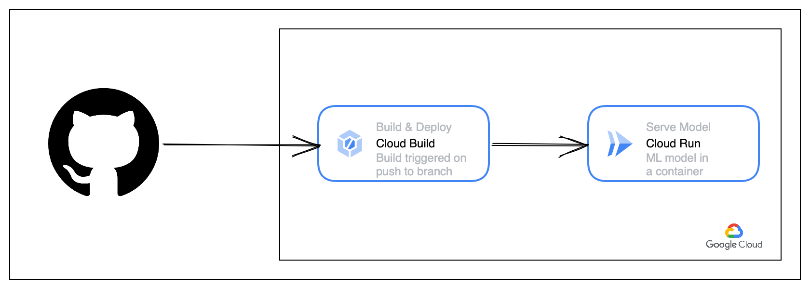

# ML - Engineering Challenge

## High-level Architecture Diagram

- The code is maintained on Github.
- When code is pushed to a branch, it triggers a Cloud Build trigger to build and push the image to Google's Container Registry. 
- After a successful push, the docker image is deployed as a service via Cloud Run which is Google's managed platform for running containers.
- The model is served as a Flask Restful API.

## How do I call the API?

Link for batch api: https://linear-regression-yqdqf5yqsq-ts.a.run.app/batch/[0.5,0.2,0.6]
Link for stream api: https://linear-regression-yqdqf5yqsq-ts.a.run.app/stream/0.5

## Repository Content

The repository has the following folders/files that are required to deploy the service:

- `model`           : Includes code for model that was provided with the challenge. 
- `Dockerfile`      : Includes instructions to build docker image.
- `main.py`         : Flask application script.
- `requirements.txt`: Python dependencies to be installed at the start of runtime.
- `setup.py`        : To package `model` module.

## What would a production pipeline look like? (Classified as critical vs nice to have for this specific challenge only)

### Testing (critical)
An ML model can often be a black-box. In order to ensure that the model is capable of generalising well to data, it is essential to test the model on a held out dataset through multiple training iterations and by varying other hyperparameters.
Model can be served in various ways. If the model is being served as an API, the API needs to be tested. 
An integration test is also required in case of an end-to-end ML pipeline.

### Data validation and pre-processing (critical)
Currently the data is generated within the model script. In an ideal scenario, data will be fed to the model from other sources. Data needs to be validated and pre-processed to ensure that it is fit for consumption by the model. This step is also important to avoid training-serving skew.

### Presistent Storage for data and model versioning. (nice to have)
The current deployment is stateless. The current training data and model pickle files are stored within the container. There is no history of model versions or other parameters. Having a Persistent storage like a blob storage service usually available on cloud will enable data storage and model storage with versioning. Other ML specific services such as model registries can also be used for this purpose of model versioning.

### Assess model re-training requirements (nice to have)
Depending on the use case, data received by the model can have newer emerging patterns over time. If the model is not re-trained, it can lead to decrease in performance. The re-training frequency needs to be asessed to ensure good performance. 

### CI/CD/CT (Continuous Integration, Continuous Deployment, Continuous Training) (nice to have)
An integrated ML Pipeline using tools like Kubeflow, TFX etc. that includes data processing, model re-training and model serving. CI/CD is required for the pipeline code whereas CT is required for ensuring good model performance on new data. A new model can be deployed only if it passes all validation checks and performs better than the previous version.

### Logging and Monitoring of model in production (nice to have)
Logging is essential for ensuring that the model serving (or API) performance does not decrease over time.
Monitoring is required for two main purposes - Training-serving skew and drift detection.
Latency of the model can also be monitored depending on the specific use-case.